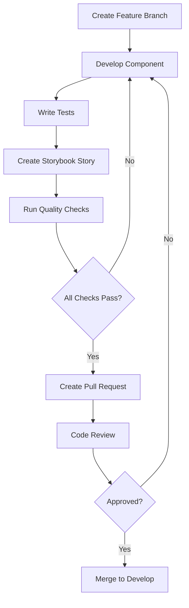

# Development Workflow Guide

## Overview

This guide establishes the development workflow for the Olli's Astro Club project, ensuring consistent practices across all contributors and AI assistants.

## Git Workflow

### Branch Strategy

We use a simplified Git Flow approach:

- **main**: Production-ready code
- **develop**: Integration branch for features
- **feature/**: Individual feature development
- **fix/**: Bug fixes
- **hotfix/**: Emergency production fixes

### Branch Naming Conventions

```bash
feature/component-name       # New component development
feature/user-authentication  # New feature implementation
fix/navigation-mobile       # Bug fixes
hotfix/security-patch       # Emergency fixes
docs/api-documentation      # Documentation updates
refactor/component-structure # Code refactoring
```

### Commit Message Format

Use Conventional Commits specification:

```
<type>[optional scope]: <description>

[optional body]

[optional footer(s)]
```

#### Types

- **feat**: New feature
- **fix**: Bug fix
- **docs**: Documentation only changes
- **style**: Changes that do not affect meaning (white-space, formatting)
- **refactor**: Code change that neither fixes a bug nor adds a feature
- **perf**: Performance improvements
- **test**: Adding missing tests or correcting existing tests
- **chore**: Changes to build process or auxiliary tools

#### Examples

```bash
feat(auth): add user login component
fix(navigation): resolve mobile menu overflow issue
docs(readme): update installation instructions
style(button): fix indentation in component styles
refactor(utils): simplify date formatting function
test(carousel): add unit tests for slide navigation
chore(deps): update lit-element to version 3.0.0
```

## Development Process

### 1. Feature Development Lifecycle



### 2. Quality Gates

Before any code is merged, it must pass these checks:

#### Automated Checks

- [ ] TypeScript compilation succeeds
- [ ] ESLint rules pass (zero warnings)
- [ ] Unit tests pass (>80% coverage)
- [ ] Storybook builds successfully
- [ ] Build process completes without errors

#### Manual Review Checklist

- [ ] Component follows design system patterns
- [ ] Accessibility requirements met (WCAG 2.1 AA)
- [ ] Mobile responsiveness verified
- [ ] Cross-browser compatibility tested
- [ ] Performance impact assessed
- [ ] Documentation updated

### 3. Testing Strategy

#### Unit Testing (Vitest)

```typescript
// Example unit test structure
import { expect, test, describe } from 'vitest';
import { fixture, html } from '@open-wc/testing';
import './astro-button.js';
import type { AstroButton } from './astro-button.js';

describe('AstroButton', () => {
  test('should render with default properties', async () => {
    const el = await fixture<AstroButton>(html`
      <astro-button>Click me</astro-button>
    `);
    
    expect(el.textContent?.trim()).toBe('Click me');
    expect(el.variant).toBe('primary');
  });

  test('should emit click event when clicked', async () => {
    const el = await fixture<AstroButton>(html`
      <astro-button>Click me</astro-button>
    `);
    
    let eventFired = false;
    el.addEventListener('click', () => { eventFired = true; });
    
    el.click();
    expect(eventFired).toBe(true);
  });
});
```

#### Integration Testing

Test component interactions and data flow between components:

```typescript
// Example integration test
describe('Navigation Integration', () => {
  test('should update active state when route changes', async () => {
    const nav = await fixture(html`
      <astro-navigation current-route="/astro-tips"></astro-navigation>
    `);
    
    const activeItem = nav.shadowRoot?.querySelector('[aria-current="page"]');
    expect(activeItem?.textContent).toContain('Astro Tips');
  });
});
```

#### E2E Testing (Playwright)

```typescript
// Example E2E test
import { test, expect } from '@playwright/test';

test('user can navigate through astronomy tips', async ({ page }) => {
  await page.goto('/');
  
  // Click on Astro Tips navigation
  await page.click('text=Astro Tips');
  await expect(page).toHaveURL('/astro-tips');
  
  // Verify content loads
  await expect(page.locator('h1')).toContainText('Astronomy Tips');
  
  // Test responsive design
  await page.setViewportSize({ width: 375, height: 667 });
  await expect(page.locator('.mobile-menu')).toBeVisible();
});
```

## Code Review Process

### Pull Request Template

```markdown
## Description
Brief description of changes made.

## Type of Change
- [ ] Bug fix (non-breaking change which fixes an issue)
- [ ] New feature (non-breaking change which adds functionality)
- [ ] Breaking change (fix or feature that would cause existing functionality to not work as expected)
- [ ] Documentation update

## Testing
- [ ] Unit tests added/updated
- [ ] Integration tests added/updated
- [ ] E2E tests added/updated
- [ ] Manual testing completed

## Accessibility
- [ ] Keyboard navigation tested
- [ ] Screen reader compatibility verified
- [ ] Color contrast meets WCAG 2.1 AA standards
- [ ] Alternative text provided for images

## Performance
- [ ] Bundle size impact assessed
- [ ] Lighthouse score maintained/improved
- [ ] Core Web Vitals impact measured

## Screenshots
Include screenshots for UI changes.

## Checklist
- [ ] Code follows style guidelines
- [ ] Self-review completed
- [ ] Comments added for complex logic
- [ ] Documentation updated
- [ ] Storybook story created/updated
```

### Review Criteria

#### Code Quality

- **Readability**: Code is clear and self-documenting
- **Maintainability**: Easy to modify and extend
- **Performance**: No unnecessary re-renders or computations
- **Security**: No security vulnerabilities introduced

#### Component Design

- **Reusability**: Component can be used in multiple contexts
- **Composability**: Works well with other components
- **Accessibility**: Follows ARIA standards and guidelines
- **Responsive**: Works on all target device sizes

## Continuous Integration

### GitHub Actions Workflow

```yaml
name: CI/CD Pipeline

on:
  push:
    branches: [ main, develop ]
  pull_request:
    branches: [ main, develop ]

jobs:
  test:
    runs-on: ubuntu-latest
    steps:
      - uses: actions/checkout@v3
      - uses: actions/setup-node@v3
        with:
          node-version: '18'
          cache: 'npm'
      
      - run: npm ci
      - run: npm run lint
      - run: npm run type-check
      - run: npm run test
      - run: npm run build
      - run: npm run test:e2e

  accessibility:
    runs-on: ubuntu-latest
    steps:
      - uses: actions/checkout@v3
      - uses: actions/setup-node@v3
        with:
          node-version: '18'
          cache: 'npm'
      
      - run: npm ci
      - run: npm run build
      - run: npm run test:a11y

  deploy:
    needs: [test, accessibility]
    runs-on: ubuntu-latest
    if: github.ref == 'refs/heads/main'
    steps:
      - uses: actions/checkout@v3
      - run: npm ci
      - run: npm run build
      - run: npm run deploy
```

## Local Development Setup

### Prerequisites

- Node.js 18+
- npm 9+
- Git
- VS Code (recommended)

### Initial Setup

```bash
# Clone the repository
git clone https://github.com/schafeld/ollis-astro-club.git
cd ollis-astro-club

# Install dependencies
npm install

# Start development server
npm run dev

# In separate terminals:
npm run storybook  # Component development
npm run test:watch # Continuous testing
```

### Daily Workflow

```bash
# Start of day
git checkout develop
git pull origin develop

# Create feature branch
git checkout -b feature/new-component

# Development cycle
npm run dev          # Start dev server
npm run test:watch   # Run tests continuously
npm run storybook    # Component development

# Before committing
npm run lint         # Check code style
npm run type-check   # Verify TypeScript
npm run test         # Run all tests
npm run build        # Verify build

# Commit and push
git add .
git commit -m "feat(component): add new astronomy card component"
git push origin feature/new-component
```

## Release Process

### Version Management

We use semantic versioning (SemVer):

- **MAJOR**: Breaking changes
- **MINOR**: New features (backward compatible)
- **PATCH**: Bug fixes (backward compatible)

### Release Steps

1. **Prepare Release Branch**
   ```bash
   git checkout develop
   git pull origin develop
   git checkout -b release/v1.2.0
   ```

2. **Update Version and Changelog**
   ```bash
   npm version minor  # or major/patch
   # Update CHANGELOG.md
   ```

3. **Final Testing**
   ```bash
   npm run test:all
   npm run build
   npm run test:e2e
   ```

4. **Merge and Tag**
   ```bash
   git checkout main
   git merge release/v1.2.0
   git tag v1.2.0
   git push origin main --tags
   ```

## AI Development Guidelines

### For AI Assistants

When working on this project:

1. **Always follow the established patterns** in existing components
2. **Write tests first** when developing new features (TDD approach)
3. **Update Storybook stories** for any component changes
4. **Consider accessibility** from the beginning, not as an afterthought
5. **Document your changes** in code comments and README files
6. **Check performance impact** of new components

### Code Generation Best Practices

- Use TypeScript strict mode
- Follow the established naming conventions
- Include proper JSDoc comments
- Add error handling and edge cases
- Consider internationalization from the start

## Troubleshooting

### Common Issues

**Build Failures**
- Check TypeScript errors first
- Verify all imports are correct
- Ensure all dependencies are installed

**Test Failures**
- Run tests in isolation to identify issues
- Check for timing issues in async tests
- Verify test data and mocks are correct

**Storybook Issues**
- Clear Storybook cache: `npm run storybook:clean`
- Check for conflicting CSS or dependencies
- Verify story syntax and component imports

---

*This workflow should be followed by all contributors to maintain code quality and project consistency.*